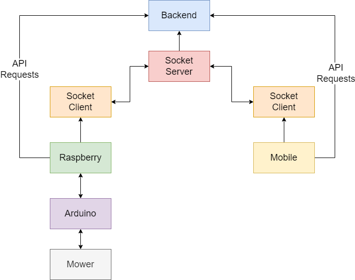

# WallE Software Design

# Requirements
* Mower
  - Be able to run autonomously within a confined area.
  - Be able to avoid collision objects during autonomous operation.
  - Be able to accept and execute drive commands given by a remote device.
  - Shall use a camera and send images to the backend when collision avoidance occurs.
* Mobile
  - Shall take user input and translate them to drive commands for the WallE.
  - Shall visualize the path travelled by WallE including collision avoidance events.
* Backend
  - Publish REST API for reading and writing position data from WallE.
  - REST API shall contain a service for reading and writing image data.
  - When image data is written, shall perform an image classification via for example Google API.

# Contents
* Architecture Overview
* Mower
* Mobile
* Backend

# Architecture
**[NOTE] explain overall architecture here**

# Requirements Breakdown
This chapter lists each high level requirement and gives an overview of how it has been achieve. 

## Mower Requirments
### Requirement: Be able to run autonomously within a confined area.
Explain

### Requirement: Be able to avoid collision objects during autonomous operation.
Explain

### Requirement: Be able to accept and execute drive commands given by a remote device.
Explain

### Requirement: Shall use a camera and send images to the backend when collision avoidance occurs.
Explain

---

## Mobile Requirements
### Shall take user input and translate them to drive commands for the WallE.
Explain

### Shall visualize the path travelled by WallE including collision avoidance events.
Explain

---

## Backend Requirements
### Publish REST API for reading and writing position data from WallE.
Explain

### REST API shall contain a service for reading and writing image data.
Explain

### When image data is written, shall perform an image classification via for example Google API.