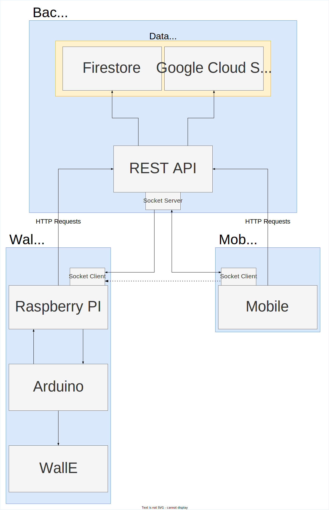

# WallE Software Design
In this documentation, any mention of "WallE" refers to our WallE robot.

# Requirements
* WallE
  - [x] [🔗](#requirement-be-able-to-run-autonomously-within-a-confined-area) Be able to run autonomously within a confined area.
  - [x] [🔗](#requirement-be-able-to-avoid-collision-objects-during-autonomous-operation) Be able to avoid collision objects during autonomous operation.
  - [x] [🔗](#requirement-be-able-to-accept-and-execute-drive-commands-given-by-a-remote-device) Be able to accept and execute drive commands given by a remote device.
  - [x] [🔗](#requirement-shall-use-a-camera-and-send-images-to-the-backend-when-collision-avoidance-occurs) Shall use a camera and send images to the backend when collision avoidance occurs.
* Mobile
  - [x] [🔗](#shall-take-user-input-and-translate-them-to-drive-commands-for-the-walle) Shall take user input and translate them to drive commands for the WallE.
  - [x] [🔗](#shall-visualize-the-path-travelled-by-walle-including-collision-avoidance-events) Shall visualize the path travelled by WallE including collision avoidance events.
* Backend
  - [x] [🔗](#publish-rest-api-for-reading-and-writing-position-data-from-walle) Publish REST API for reading and writing position data from WallE.
  - [x] [🔗](#rest-api-shall-contain-a-service-for-reading-and-writing-image-data) REST API shall contain a service for reading and writing image data.
  - [x] [🔗](#when-image-data-is-written-shall-perform-an-image-classification-via-for-example-google-api) When image data is written, shall perform an image classification via for example Google API.

# Contents
* Architecture Overview
* WallE
* Mobile
* Backend

# Architecture
The architecture of the entire system can be divided into three major components `Backend`, `Mobile` and `WallE`. These major components, in turn, have their own major sub-components. This chapter will provide an overview of each major component along with links to more detailed implementations.

### Major Components
## WallE
...

See [WallE](wallE/index.md) for implementation details.

## Backend
...

See [Backend](backend/index.md) for implementation details.

## Mobile
...

See [Mobile](mobile/index.md) for implementation details.

# Requirements Breakdown
This chapter lists each high level requirement and gives an overview of how it has been achieve. 

## WallE Requirments
> ### [x] Requirement: Be able to run autonomously within a confined area.
Explain overall how it is achieved then link to implementation details

> ### [x] Requirement: Be able to avoid collision objects during autonomous operation.
Explain overall how it is achieved then link to implementation details

> ### [x] Requirement: Be able to accept and execute drive commands given by a remote device.
Explain overall how it is achieved then link to implementation details

> ### [x] Requirement: Shall use a camera and send images to the backend when collision avoidance occurs.
Explain overall how it is achieved then link to implementation details

---

## Mobile Requirements
> ### [x] Shall take user input and translate them to drive commands for the WallE.
Explain overall how it is achieved then link to implementation details

> ### [x] Shall visualize the path travelled by WallE including collision avoidance events.
Explain overall how it is achieved then link to implementation details

---

## Backend Requirements
> ### [x] Publish REST API for reading and writing position data from WallE.
Explain overall how it is achieved then link to implementation details

> ### [x] REST API shall contain a service for reading and writing image data.
Explain overall how it is achieved then link to implementation details

> ### [x] When image data is written, shall perform an image classification via for example Google API.
Explain overall how it is achieved then link to implementation details