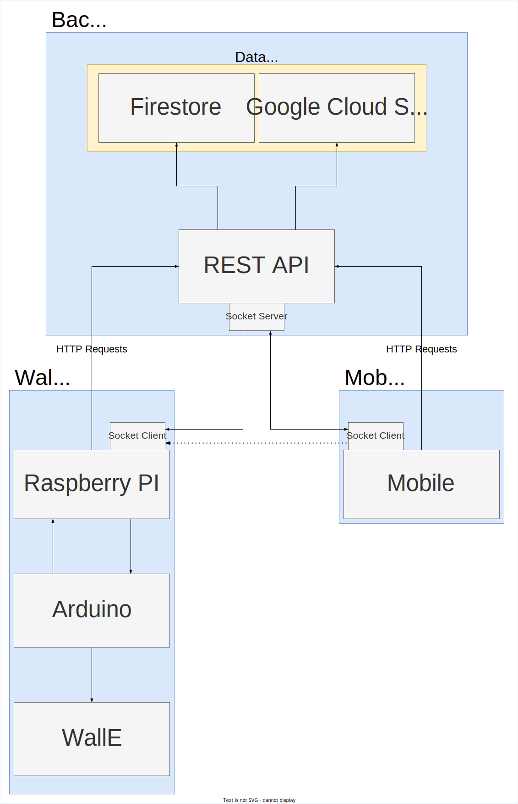

# WallE Software Design
In this documentation, any mention of "WallE" refers to our WallE robot.

# Requirements
* WallE
  - [x] [🔗](#requirement-be-able-to-run-autonomously-within-a-confined-area) Be able to run autonomously within a confined area.
  - [x] [🔗](#requirement-be-able-to-avoid-collision-objects-during-autonomous-operation) Be able to avoid collision objects during autonomous operation.
  - [x] [🔗](#requirement-be-able-to-accept-and-execute-drive-commands-given-by-a-remote-device) Be able to accept and execute drive commands given by a remote device.
  - [x] [🔗](#requirement-shall-use-a-camera-and-send-images-to-the-backend-when-collision-avoidance-occurs) Shall use a camera and send images to the backend when collision avoidance occurs.
* Mobile
  - [x] [🔗](#shall-take-user-input-and-translate-them-to-drive-commands-for-the-walle) Shall take user input and translate them to drive commands for the WallE.
  - [x] [🔗](#shall-visualize-the-path-travelled-by-walle-including-collision-avoidance-events) Shall visualize the path travelled by WallE including collision avoidance events.
* Backend
  - [x] [🔗](#publish-rest-api-for-reading-and-writing-position-data-from-walle) Publish REST API for reading and writing position data from WallE.
  - [x] [🔗](#rest-api-shall-contain-a-service-for-reading-and-writing-image-data) REST API shall contain a service for reading and writing image data.
  - [x] [🔗](#when-image-data-is-written-shall-perform-an-image-classification-via-for-example-google-api) When image data is written, shall perform an image classification via for example Google API.

# Contents
* [Architecture Overview](#architecture)
* [Requirement Breakdown](#requirements-breakdown)
* [WallE](wallE/Software%20Design%20Description.md)
* [Mobile](mobile/software_Design_Document.md)
* [Backend](backend/index.md)

# Architecture
The architecture of the entire system can be divided into three major components `Backend`, `Mobile` and `WallE`. These major components, in turn, have their own sub-components. This chapter will provide an overview of each major component along with links to more detailed implementations. `LINK TO FIGURE`

### Major Components
## WallE
WallE or Mower is the major component that is considered the physical unit. This hosts everything for controlling low level movements, collision(obstacle) events, calculating relative position, etc. WallE has three sub components, each to take care of the low level requirements needed. WallE has two communication channel with the [Backend](#backend), HTTP requests and a socket connection. 

See [WallE](wallE/Software%20Design%20Description.md) for implementation details.

## Backend
The backend or 'Backend' is the major component that handles data correction calculations, data storage, collision events handling, mediator between [WallE](wallE/Software%20Design%20Description.md) and [WallE](mobile/software_Design_Document.md), path generation, etc. 
Its main application is a REST API which exposes endpoints for both [WallE](wallE/Software%20Design%20Description.md) and [WallE](mobile/software_Design_Document.md). However, attached to the same appliation is a socker server which is also exposed.
The backend uses Google's [Cloud Firestore](https://firebase.google.com/docs/firestore) and [Cloud Storage](https://cloud.google.com/storage) for data storage. 

See [Backend](backend/index.md) for implementation details.

## Mobile
The app or 'Mobile' is the major component that deals with user interaction and interface. It is a [React Native](https://reactnative.dev/) application which displays visual feedback of [WallE](wallE/Software%20Design%20Description.md)'s position and collision events. Mobile also provides an [WallE](wallE/Software%20Design%20Description.md) control interface for manual/automatic control over [WallE](wallE/Software%20Design%20Description.md).

See [Mobile](mobile/software_Design_Document.md) for implementation details.

# Requirements Breakdown
This chapter lists each high level requirement and gives an overview of how it has been achieved. 

## WallE Requirments
* > ### Requirement: Be able to run autonomously within a confined area.

  Achieved by utilizing downfacing color sensors attached to [WallE](wallE/Software%20Design%20Description.md). The confined area is defined by a `black` perimeter which black tape is often used to define. The sensors fire when it detects black, at which point [WallE](wallE/Software%20Design%20Description.md) is programmed to turn and move in a random direction. Movement is handled through the robot sub component's API. 

  ---

* > ### Requirement: Be able to avoid collision objects during autonomous operation.
  Achieved by utilizing two forward facing sensors that reads the distance of objects infront of them. [WallE](wallE/Software%20Design%20Description.md) has a set distance threshold which when entered, fires an event which in turn [WallE](wallE/Software%20Design%20Description.md) listens and is intructed to turn and move in a random direction.
  
  ---
* > ### Requirement: Be able to accept and execute drive commands given by a remote device.
  Achieved by running a socket client connection to the [Backend](backend/index.md). [WallE](wallE/Software%20Design%20Description.md) listens to `Commands` --Commands are what we call the messages sent through the sockets-- sent through the socket connection from [Backend](backend/index.md). Amongst these commands are `Movement Commands` which are messages that instruct [WallE](wallE/Software%20Design%20Description.md) to move either `left`, `right`, `forward`, or `backward`.
  
  ---

* > ### Requirement: Shall use a camera and send images to the backend when collision avoidance occurs.
  Upon collision event firing, [WallE](wallE/Software%20Design%20Description.md) also utilizes a camera attached to snap a photo and via HTTP request, send the image to the [Backend](backend/index.md).

See [WallE](wallE/Software%20Design%20Description.md) for requirements breakdown and implementation details.

---

## Mobile Requirements
* > ### Shall take user input and translate them to drive commands for the WallE.
  Achieved by using a socket connection with [Backend](backend/index.md) and UI buttons that send movement commands to the backend through the socket connection.
  
  ---

* > ### Shall visualize the path travelled by WallE including collision avoidance events.
  Achieved by reading [WallE](wallE/Software%20Design%20Description.md)'s position data from an endpoint on the [Backend](backend/index.md). The position data is then used to draw a visual path in the UI.

See [Mobile](mobile/software_Design_Document.md) for requirements breakdown and implementation details.

---

## Backend Requirements
* > ### Publish REST API for reading and writing position data from WallE.
  Achieved by setting up an http server and exposing endpoints under the paths `/pathpoints`. The position data is stored in a document database.
  
  ---

* > ### REST API shall contain a service for reading and writing image data.
  Achieved by setting up a REST API and exposing the endpoint `/obstacle/event` for writing image data of obstacles during collision events. Images are stored in cloud storage.
  
  ---

* > ### When image data is written, shall perform an image classification via for example Google API.
  Achieved by utilizing Google's [Cloud Vision API](https://cloud.google.com/vision) to classify images.
  
See [Backend](backend/index.md) for requirements breakdown and implementation details.

---

