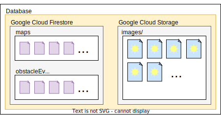

# Database

## Contents 
* [Overview](#overview)
* [Cloud Firestore](#cloud-firestore)
* [Cloud Storage](#cloud-storage)

## Overview
The database's two main parts are Google's Cloud Firestore and Cloud Storage. Cloud Firestore is used for storing information in collections and documents. Cloud Storage is used for raw data storage, more specifically in this case it is used for storing images of obstacles.

## Cloud Firestore
The two main collections stored are `maps` and `obstacleEvents`. 

### maps
The maps collection is used to store documents that hold information on the path travelled by WallE. Each document contains a property `path` which is an array of coordinates.

### obstacleEvents
Each document in the obstacleEvents collection hold information about a specific obstacle event. The information held is:
* `imageUrl` - The URL of the image of the obstacle detected. This a URL linking to an item in the [Cloud Storage](#cloud-storage) solution.
* `label` - The classification label given to the image of the obstacle.
* `timestamp` - Date and time the obstacle event occured.
* `x` - X coordinate where WallE was when the obstacle event occured.
* `y` - Y coordinate where WallE was when the obstacle event occured.

## Cloud Storage
Used to store images of obstacles detected by WallE. All images are stored under the path `images/` in the database. Each image can be access by a unique URL which allows to download the image. 