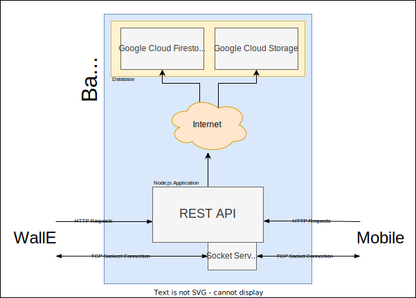

# Backend Software Design Description

## Contents
* [Introduction](#introduction)
* [Architecture](#architecture)
* [Mid-Level Requirements Breakdown](#mid-level-requirements-breakdown)
* [Node Application](node_application.md)
* [Database](database.md)
* [Testing](testing.md)

## Introduction

## Architecture

## Mid-Level Requirements Breakdown
Breakdown the high-level requirements into what is specifically required. Low-level requirements can be detailed elsewhere.

* > ### Publish REST API for reading and writing position data from WallE.
  #### Breakdown
  1. Need to set up an http server.
  2. Need to expose routes on that server.
  3. Need to persist data.
  
  ### Solution
  1. An http server is set up using the [ExpressJs](https://expressjs.com/) web application framework running on the [Node.js](https://nodejs.org/en/) platform. Node.js and ExpressJs were primarily choosen based on team competence.
  
     See [REST API implementation]().

  2. Using the ExpressJs framework, route endpoints were created and exposed. For Reading and Writing, the routes exposed are `GET` & `POST` on `/pathpoints`.
      
     See [REST API endpoints]().

  3. For data persistence, Google's [Cloud Firestore](https://firebase.google.com/docs/firestore) was chosen. It is a document database which when setup is hosted by google. This was decided upon by the team for being perceivably easy to use and does not require own database hosting.

      See [Database](database.md).  

---

* > ### REST API shall contain a service for reading and writing image data.
  #### Breakdown
  1. Need to expose new endpoints. 
  2. Need to handle storing image data.

  #### Solution
  1. Using the ExpressJs framework, a new route endpoint was created, that being `POST` `/obstacle/event`.

      See [REST API endpoints]().
  
  2. Cloud Firestore does not allow storing images. So to store image Google's [Cloud Storage](https://cloud.google.com/storage). This allows to storage image files and access each specific one via a unique url. Cloud Storage also can be set up together with Cloud Firestore.

    See [Database](database.md)

  ---

* > ### When image data is written, shall perform an image classification via for example Google API.
  Explain overall how it is achieved then link to implementation details
  
  ---