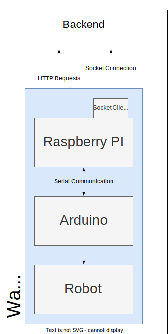

# WallE Software Design Implementation

## Contents
* [Introduction](#introduction)
* [Overview](#overview)
  * [Sub Components](#sub-components)
* [Communcation Overview](#communcation-between-components)
  * [Backend -Raspberry](#backend---raspberry)
  * [Raspberry - Arduino](#rasbperry---arduino)
  * [Arduino - Robot](#arduino---robot)
* [Mid-Level Requirements Breakdown]()

## Introduction
Introduction

## Overview

Explanaion

### Sub Components
Quick overview of each sub component.

#### Raspberry PI
One - Two sentence overiew

See [Raspberry PI]() for implementation details

#### Arduino
One - Two sentence overiew

See [Arduino]() for implementation details

## Communcation Overview Between Components
Short intro to this chapter

Contains only what technology is used to send data between but not how that data is formatted. Can include those details elsewhere.

### Backend - Raspberry
### Rasbperry - Arduino
### Arduino - Robot

## Mid-Level Requirements Breakdown
Each of these breakdown what is requirement by each sub component but not exactly how it is implemented. 

* > ### Requirement: Be able to run autonomously within a confined area.
  Explain overall how it is achieved then link to implementation details

  ---

* > ### Requirement: Be able to avoid collision objects during autonomous operation.
  Explain overall how it is achieved then link to implementation details
  
  ---
* > ### Requirement: Be able to accept and execute drive commands given by a remote device.
  Explain overall how it is achieved then link to implementation details
  
  ---

* > ### Requirement: Shall use a camera and send images to the backend when collision avoidance occurs.
  Explain overall how it is achieved then link to implementation details